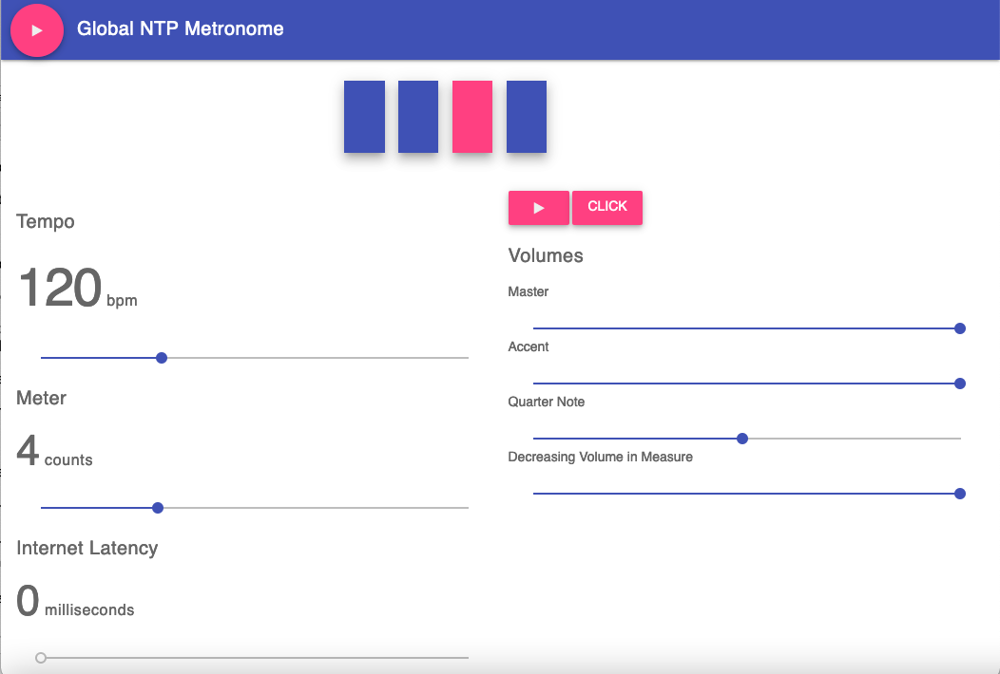

# Responsive Web Audio Metronome

## Online Demo of Javascript Offline Metronome
[Demo Javascript Metronome](https://niebert.github.io/globalmetronome)

## Fixed Issues after Forking
Issues after fork from Scott Hudsons metronome:
* [Icons for menu added](https://www.github.com/niebert/icons4menu) for missing play button
* Chrome support - runs now offline - issue fixed that was already mentioned by Scott Hudson 2016.

## Information about Scott Hudsons Work
This [metronome is based on Scott Hudson](https://github.com/scottwhudson/metronome) great work for an Offline Javascript Metronome, that runs in your browser without internet connection.

### History
* Create for the [Wikiversity Learning Resource about a Global Metronome](https://en.wikiversity.org/wiki/Online_music_jam/Global_Metronome)
* [Globals Metronme](https://github.com/niebert/globalmetronome) fixed offline running in the Chrome browser and added a global metronome clicker event that is executed on all devices simultaneously.
* [Fork of Scott Hudson Metronme](https://github.com/niebert/metronome) fixed a fetching remote libraries and CSS resources so that it runs offline.
* [Scott Hudson Metronome](https://github.com/scottwhudson/metronome) used @cwilso's [HTML5 demo metronome](http://webaudiodemos.appspot.com/metronome/index.html) as a starting point.

### Features
Scott added several features to @cwilso's [HTML5 demo metronome](http://webaudiodemos.appspot.com/metronome/index.html) which are commonly seen in professional metronomes, including:

* variable meter input
* support for triplet subdivisions
* master volume toggling
* accent volume toggling
* subdivision volume toggling
* material design UI

Furthermore Scott added triplet note support, which was the trickiest to implement, since it required converting the base note interval from a 16th note to a twelvelet, which contains both eighth note and sixteenth note intervals.

### Offline Use
Scott mentioned that Chrome doesn't like running web workers locally apparently. Chrome is widely used browser and the offline check in 2021 of the Scott's metronome did not work in Chrome now.

## Setup
1. clone the repository or [download the GitHub-ZIP of this repository](https://github.com/niebert/metronome/archive/refs/heads/master.zip)
2. open `index.html` using a browser and start the metronome.

### Todos
* update [Wikiversity Learning Resource about Global Metronome](https://en.wikiversity.org/wiki/Online_music_jam/Global_Metronome)
* toggle note pitches
* tap tempo detection
* easy sound file import
* add visual metronome
